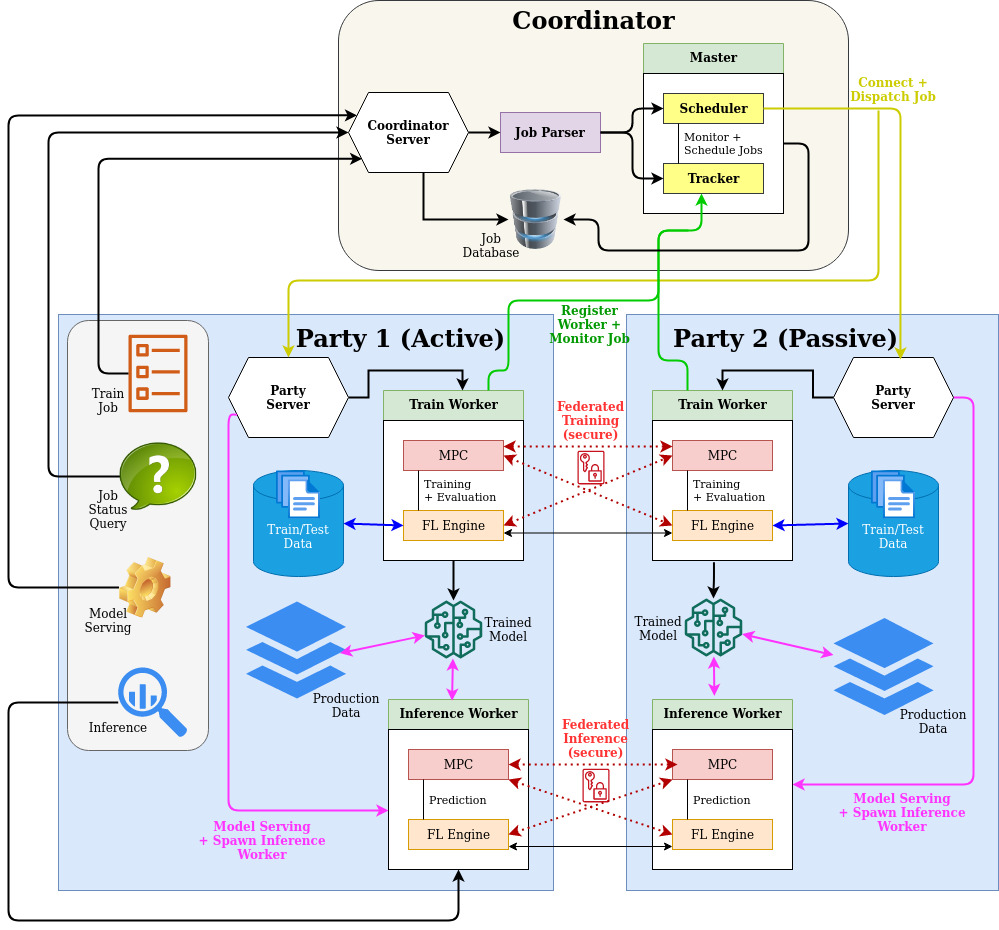

<!--  -->


# Falcon Platform (Coordinator+PartyServers)

## Dependencies for Development

- Server-side is Go (1.13 or 1.14)
- k8s (V1.9 best, V1.7 is also fine)
- Client-side is any http client, such as Python3 `requests`
- Storage default is file-based sqlite3, you can also connect to MySQL

**Go quick start**:
To run go code, you need go compiler

download the go compiler at https://golang.org/dl/

after the download, install by following the instruction at https://golang.org/doc/install

Verify that you've installed Go by opening a command prompt and typing the following command:
```sh
$ go version
```

to compile and run a go program
```sh
go run <go-program>.go
```

to compile into a binary
```sh
go build <go-program>.go
```


## Platform setup DEV (development without k8)

1. Setup coordinator:
    
    Update configurations in `src/coordinator/config_coord.properties`, choose the `JOB_DATABASE, BASE_PATH, COORD_SERVER_IP`

    Launch coordinator first:
    
    ```bash
    #Usage:
    bash dev_start_coord.sh <partyNumber>
    ```
          

1. Setup partyserver 1-N:
    
    Update `src/coordinator/config_partyserver.properties`

    Launch Party 1:
    
    ```bash
    #Usage:
    bash dev_start_partyserver.sh 1
    ```

    Launch Party 2:
    
    ```bash
    #Usage:
    bash dev_start_partyserver.sh 2
    ```

    Launch Party X:
    
    ```bash
    #Usage:
    bash dev_start_partyserver.sh X
    ```

## Platform setup PROD (production with k8)

0. docker image is upload, if u wanna build yourself, try with:

   ```
   bash scripts/img_build.sh
   ```

1. Setup coordinator:
    Update config_coord.properties
    choose the JOB_DATABASE, BASE_PATH, COORD_SERVER_IP
    finally run script with following
    
    ```
    bash scripts/start_coord.sh
    ```

2. Setup partyserver:
    Update config_partyserver.properties
    choose the PARTY_SERVER_IP, COORD_SERVER_IP, PARTY_SERVER_NODE_PORT
    finally run script with following

    ```
    bash scripts/start_partyserver.sh
    ```
      
## Interact with the platform (submit jobs, monitor jobs etc)

1. define your job.json, similar to the example provided in ./data/job.json

2. submit job:
    
    python coordinator_client.py -url <ip url of coordinator>:6573 -method submit -path ./data/job.json
    
    ```
    python3 coordinator_client.py -url 127.0.0.1:30004 -method submit -path ./data/three_parties_train_job.json
    ```


3. kill job:
    
    python coordinator_client.py -url <ip url of coordinator>:6573 -method kill -job <job_id>
    
    ```
    python coordinator_client.py -url 172.25.123.254:30004 -method kill -job 60
    ```

4. query job status:
    
    python coordinator_client.py -url <ip url of coordinator>:6573 -method query_status -job <job_id>
    
    ```
    python coordinator_client.py -url 172.25.123.254:30004 -method query_status -job 60
    ```

## check the log

1.  log is at folder `$BASE_PATH/runtime_logs/` , 
    platform setup log is at `$BASE_PATH/logs/` ,
    db is at     `dev_test/coord/falcon.db` 

```bash
dev_test/
├── coord
│   ├── falcon.db
│   └── runtime_logs
│       └── coord2020-12-27T14:47:31.logs
├── party1
│   ├── data_input
│   ├── data_output
│   ├── logs
│   │   └── runtime_logs
│   │       └── partyserver2020-12-27T14:47:50.logs
│   └── trained_models
├── party2
│   ├── data_input
│   ├── data_output
│   ├── logs
│   │   └── runtime_logs
│   │       └── partyserver2020-12-27T14:47:45.logs
│   └── trained_models
└── party3
    ├── data_input
    ├── data_output
    ├── logs
    └── trained_models
...
```
